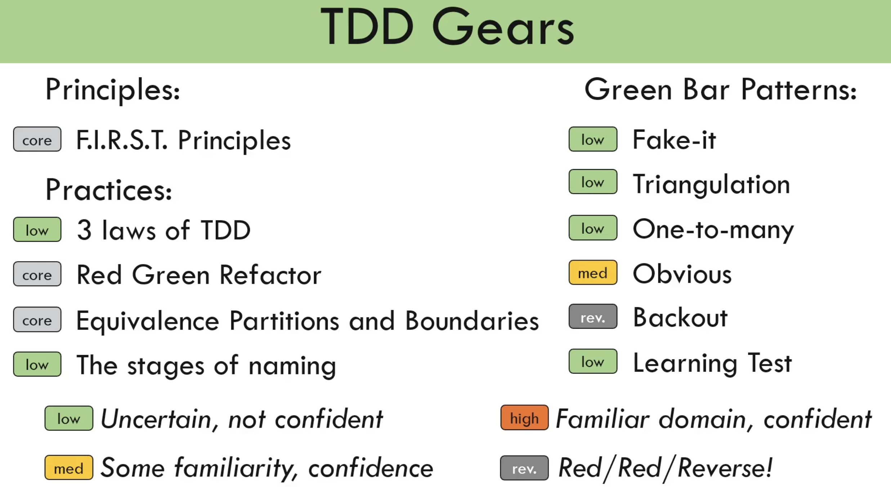

# tdd-fundamentals-in-typescript

### So , what is this Kata about ? 


---


Config : 

1. Set up the node project 
  
    ```bash

     npm init -y

    ```
1. Install typescript / jest / types for jest / typescript jest translator . As dev dependency's
    
    ```bash
       npm i -D jest typescript @types/jest ts-jest
    ```
1. Set up the jest config file :
   
   ```bash
      npx ts-jest config:init
   ```
   > Which will create `jest.config.js` file
1. Create a `.tsconfig.json` file with the following command ( to get rid of the error message in the command line  while running jest):
     
     ```bash
      npx tsc --init
     ```
1. Next set up a script to run tests every time there is a change in the code : 
    
    ```json

        "scripts": {
          "test": "jest --watchAll --verbose"
        }

    ```
1. Copying the `Starter TDD configuration` for any project 
   
  ```bash
      1. create a new project :  mkdir new-tdd-node-project 
      2. move all configuration , except node_modules to new   project:   mv  ../tdd2/*.* ./    
      3. install all node dependencies :  npm i 
      4. run the jest script :  npm run test
   ```


### Typical Structure of a Test
> 1. _Arrange_ :  Get together all the variables needed to conduct the test .
> 1. _Act_ : Execute the 1 thing to be tested.
> 1. _Assert_ : Verify your **actual** value matches the **expected** value.


---

### F.I.R.S.T Principles for Testing 

> The principles you should keep in mind while writing any test code

1. _(F)ast_ : The test should be **FAST**
1. _(I)ndependent/Isolated_ : The test should be **independent** and self contained ( our test should not depend on external dependencies , and one test should not interfere with other tests , and does not depend on external databases / http requests etc )
1. _(R)epeatable_ : Every time the test is executed , the result should be the same [ Deterministic test ]   
    - Should not have `flickering tests` i.e: Some times pass / other times fail
1. _(S)elf-Validating_ : Tests should either `pass` or `fail`
1. _(T)horough_ : Tests should  cover all scenarios at the unit level using TDD. Because , as you go up , the tests become less.     
    + E2E tests are the least ( as they take a lot of time)     
    +  Integration Tests are a bit more (As they take a little less time )   
    + Unit tests are the most (As they take the least time and can cover all scenarios at the unit level) .


---

### The 3 Laws of TDD

1. You are not allowed to write any production code _unless it is to make a production code pass_
1. You are not allowed to write any more of a  unit test than is sufficient to fail ; a compilation error is a failure
1. You are not allowed to write any production code than is sufficient to pass the unit test

